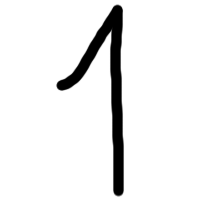
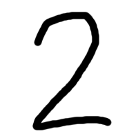

# Apache Spark Naive Bayes example

This is a simple tutorial on using Naive Bayes classifier in Apache Spark. We will use it to recognize numbers in BMP images written by hand.

For example, given the following image:



we expect our program to give us '1'.

##Creating the input set

The first step is to create data that we can use to train the model. I made a bunch of BMP images of size 200x200 pixels and wrote a number 0-9 on each of them using Windows Paint program and the brush tool of size 10. You can find these files in the [images](./images) folder. I made only 5 samples for each number, but that will be enough for our simple demonstration.

Then I used a small Python program to convert the images into a CSV file _total.txt_ that contains one line for each image.  Each line in _total.txt_ contains 'class value' we wish to predict (9 for images with nines, 8 for images with eights etc.) and then 0 or 1 for each pixel in the image: 0 if the pixel is white (value 255) and 1 if the pixel is anything else. Prior to the conversion, the program converts the images to black and white resizes them to 20x20 pixels, so as to reduce the number of dimensions in the input set.

You can create _total.txt_ for all images in the [images](./images) folder if you position yourself in the [python](./python) folder and execute the following snippet in the Python shell:

```python
from bmptocsv import convert
classes = { 'zero': 0, 'one': 1, 'two': 2, 'three': 3, 'four': 4, 'five': 5, 'six': 6, 'seven': 7, 'eight': 8, 'nine': 9}
for name, clvalue in classes.iteritems():
        convert.convert_all('../images', name, clvalue)
```

The file _total.txt_ will then contain lines similar to this one:

```python
9,0,0,0,0,0,0,0,0,0,0,0,0,0,0,0,0,0,0,0,0,0,0,0,0,0,0,0,0,0,0,0,0,0,0,0,0,0,0,0,0,0,0,0,0,0,0,0,0,0,0,0,0,0,0,0,0,0,0,0,0,0,0,0,0,0,0,0,0,0,1,1,1,1,1,0,0,0,0,0,0,0,0,0,0,0,0,0,1,1,0,0,0,0,0,0,0,0,0,0,0,0,0,0,0,0,0,1,0,0,0,0,0,0,1,1,0,0,0,0,0,0,0,0,0,0,1,0,0,0,0,0,0,0,1,1,0,0,0,0,0,0,0,0,0,0,1,0,0,0,0,0,0,0,1,1,0,0,0,0,0,0,0,0,0,0,1,1,0,0,0,0,0,0,1,1,0,0,0,0,0,0,0,0,0,0,0,1,1,0,0,0,0,1,1,1,0,0,0,0,0,0,0,0,0,0,0,0,1,1,1,1,1,1,0,1,0,0,0,0,0,0,0,0,0,0,0,0,0,0,0,0,0,0,0,1,0,0,0,0,0,0,0,0,0,0,0,0,0,0,0,0,0,0,0,1,0,0,0,0,0,0,0,0,0,0,0,0,0,0,0,0,0,0,0,1,0,0,0,0,0,0,0,0,1,0,0,0,0,0,0,0,0,0,0,1,0,0,0,0,0,0,0,0,0,1,1,0,0,0,0,0,0,0,1,0,0,0,0,0,0,0,0,0,0,0,1,1,0,0,0,0,0,0,1,0,0,0,0,0,0,0,0,0,0,0,0,1,1,0,0,0,0,1,0,0,0,0,0,0,0,0,0,0,0,0,0,0,0,1,1,1,1,0,0,0,0,0,0,0,0,0,0,0,0,0,0,0,0,0,0,0,0,0,0,0,0,0,0,0,0
```

Ok. Now that's settled, we can start creating our model.

##Training the model

To make a real Apache Spark example, I will put _total.txt_ file in HDFS:

```
hdfs dfs -put total.txt /tmp/total.txt
```

But if you don't have HDFS at hand, you can put the file on a shared disk, S3 storage or some place else accessible to Spark.

If you open the Spark Scala shell, you can train the model with this small Scala snippet (Python example would be very similar):


```scala
import org.apache.spark.mllib.classification.NaiveBayes
import org.apache.spark.mllib.linalg.Vectors
import org.apache.spark.mllib.regression.LabeledPoint

val data = sc.textFile("hdfs:///tmp/total.txt", 6)
val parsedData = data.map( line => {
  val parts = line.split(',')
  LabeledPoint(parts(0).toDouble, Vectors.dense(parts.slice(1, parts.length).map(_.toDouble)))
})
val model = NaiveBayes.train(parsedData, lambda=1.0)
```

Here data is first loaded into _data_ RDD, whose elements are lines from _total.txt_. The RDD is split into 6 partitions, which means that the future tasks on _data_ will be performed with parallelism of 6.
Next, _data_ is mapped to _parsedData_, which will contain instances of LabeledPoint class for each line in _data_ RDD. LabeledPoint contains a label (our 'class value') and a feature Vector (our ones and zeros).
Finally, _parsedData_ is used for training a Naive Bayes classifier model.

And that's it! We have a working model that can be used for recognizing handwritten numbers.

Since we only used 5 samples per number, the predictions of our model won't be very accurate, but you can always add more samples and experiment further.

##Testing the model
We can now try out our model on some fresh new images. Open up Windows Paint program (or some other imaging program of your choice), create a new image of some comfortable size (but use equal height and width) and choose a thick brush. Then write a number of your choice and save the file as BMP.

Let us see what we will get for this piece of art:


First, we need to convert the image into our feature vector. For this you can use _convert_image_ program. For example image above you would invoke it like this (while positioned in the [python](./python) directory):

```python
convert.convert_image('../images', 'testone1')
```

It will print the resulting line to stdout. In a real system, this would be integrated with the Spark program, but in this simple tutorial, you will have to copy the output and paste it into the Spark Scala shell to create _testitem_ String value:

```scala
val testitem = "0,0,0,0,0,0,0,0,0,0,0,0,0,0,0,0,0,0,0,0,0,0,0,0,0,0,0,0,0,1,1,1,1,0,0,0,0,0,0,0,0,0,0,0,0,0,0,0,1,0,0,0,0,0,1,0,0,0,0,0,0,0,0,0,0,0,0,1,0,0,0,0,0,0,1,0,0,0,0,0,0,0,0,0,0,0,1,0,0,0,0,0,0,0,1,0,0,0,0,0,0,0,0,0,0,0,1,0,0,0,0,0,0,1,0,0,0,0,0,0,0,0,0,0,0,0,0,0,0,0,0,0,0,1,0,0,0,0,0,0,0,0,0,0,0,0,0,0,0,0,0,0,1,0,0,0,0,0,0,0,0,0,0,0,0,0,0,0,0,0,0,0,1,0,0,0,0,0,0,0,0,0,0,0,0,0,0,0,0,0,0,1,0,0,0,0,0,0,0,0,0,0,0,0,0,0,0,0,0,0,0,1,0,0,0,0,0,0,0,0,0,0,0,0,0,0,0,0,0,0,1,0,0,0,0,0,0,0,0,0,0,0,0,0,0,0,0,0,0,0,1,0,0,0,0,0,0,0,0,0,0,0,0,0,0,0,0,0,0,1,0,0,0,0,0,0,0,0,0,0,0,0,0,0,0,0,0,0,1,0,0,0,0,0,0,0,0,0,0,0,0,0,0,0,0,0,0,1,1,0,0,0,0,0,0,0,0,0,0,0,0,0,0,0,0,0,0,1,0,0,0,0,0,0,0,0,0,0,0,0,0,0,0,0,0,0,0,0,0,0,0,1,1,1,1,1,1,0,0,0,0,0,0,0,0,0,0,0,0,0,0,0,0,0,0,0,0,0,0,0,0,0,0,0,0,0,0,0,0,0,0,0,0,0,0,0,0,0,0,0"
```

To use this data for classification, we need to convert it to a Vector and have it in an RDD:

```scala
val testdata = sc.parallelize(List(testitem))
val mapped = testdata.map(line => Vectors.dense(line.split(",").map(_.toDouble)))
```

Finally, we can get the prediction for our test image:

```scala
scala> model.predict(mapped).collect()
res0: Array[Double] = Array(1.0)
```

Well done, Spark!

In [images](./images) folder there are ten test images (testone1.bmp, testtwo1.bmp, testthree1.bmp, etc.). If you do this for each of them, you will get the following results:

| Image  | Predicted label  |
|--:|:-:|
| testzero1.bmp  | 6  |
| testone1.bmp  | 1  |
| testtwo1.bmp  | 2  |
| testthree1.bmp  | 3  |
| testfour1.bmp  | 4  |
| testfive1.bmp  | 5  |
| testsix1.bmp  | 8  |
| testseven1.bmp  | 7  |
| testeight1.bmp  | 8  |
| testnine1.bmp  | 3  |

As you can see, our model gives the wrong result only for zero, six and nine. That's actually not that bad for such a small number of samples.

Of course, the example can be expanded to small case and big case letters or something similar. Naive Bayes is usually good at classifying documents, which is similar to our example.

As people say in Croatia - short but sweet.
